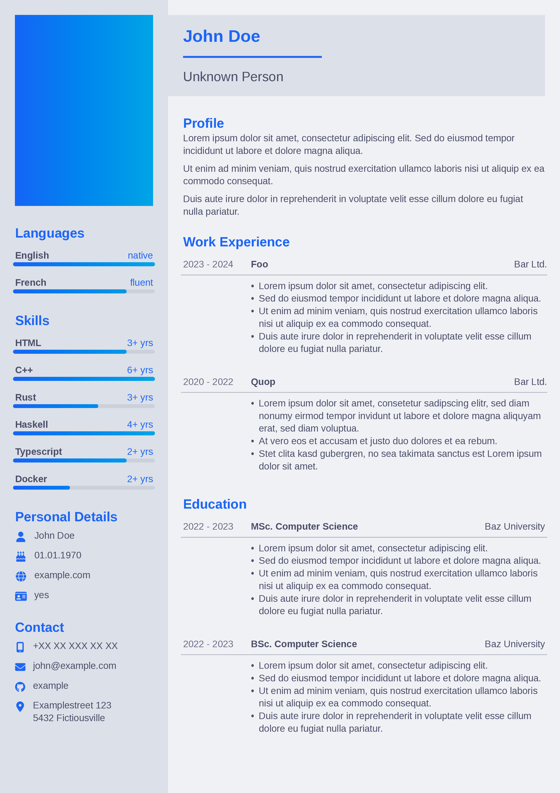

A pdf generator for CVs using typst



## Usage

```bash
# Download JSON file into working directory
curl https://raw.githubusercontent.com/morrisfeist/cvgen/master/docs/cv.json --output cv.json

# Edit JSON file with your editor of choice
nano/vim/emacs/code/… cv.json

# Create `cv.pdf` in working directory
nix run github:morrisfeist/cvgen -- cv.json
```
