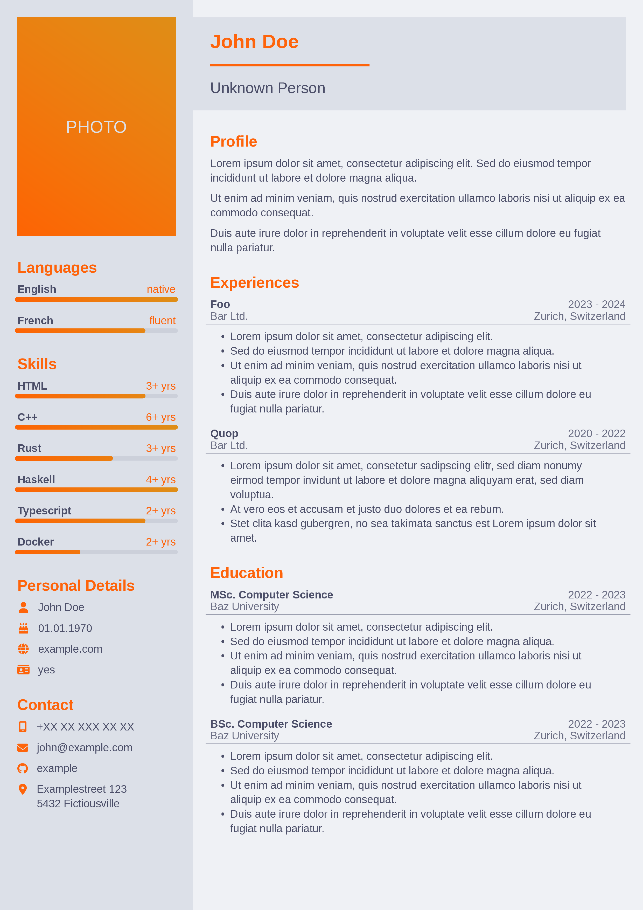

A PDF generator for CVs using typst



## Usage

```bash
# Download JSON file into working directory
curl https://raw.githubusercontent.com/morrisfeist/cvgen/master/docs/cv.json --output cv.json

# Edit JSON file with your editor of choice
nano/vim/emacs/code/… cv.json

# Create `cv.pdf` in working directory
nix run github:morrisfeist/cvgen -- cv.json
```

Alternativly to continuously work on it while reviewing changes:

```bash
# Download JSON file into working directory
curl https://raw.githubusercontent.com/morrisfeist/cvgen/master/docs/cv.json --output cv.json

# Create `cv.pdf` in working directory
nix run github:morrisfeist/cvgen#watch -- cv.json

# Open pdf-viewer that reloads the document when it is updated
# e.g.
zathura cv.pdf

# Edit JSON file with your editor of choice
nano/vim/emacs/code/… cv.json
```
